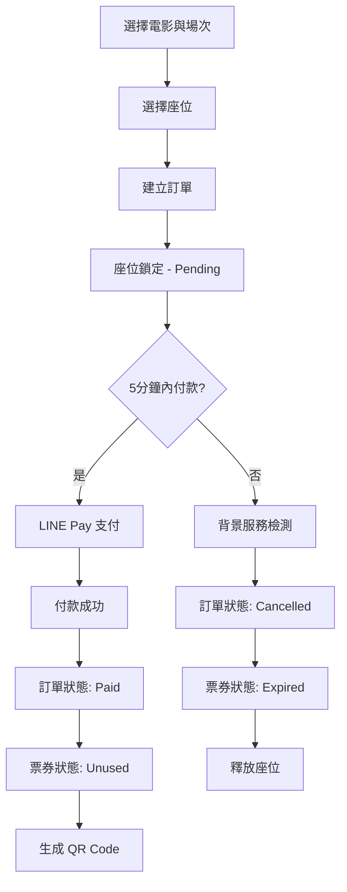

# 🎬 BetterThanVieShow - 電影院訂票系統

> 一個現代化、全功能的電影院訂票與管理系統，採用 ASP.NET Core 9.0 構建，支援線上訂票、即時座位選擇、LINE Pay 支付、QR Code 驗票及完整的後台管理功能。

[](https://dotnet.microsoft.com/)
[](https://docs.microsoft.com/en-us/dotnet/csharp/)
[](https://www.microsoft.com/sql-server)
[](LICENSE)

---

## 📋 目錄

- [系統概述](#-系統概述)
- [功能特色](#-功能特色)
- [技術架構](#️-技術架構)
- [專案結構](#-專案結構)
- [快速開始](#-快速開始)
- [資料模型](#-資料模型)
- [API 文件](#-api-文件)
- [核心功能說明](#-核心功能說明)
- [部署指南](#-部署指南)
- [開發規範](#-開發規範)
- [常見問題](#-常見問題)
- [授權](#-授權)

---

## 🎯 系統概述

**BetterThanVieShow** 是一個企業級的電影院訂票管理系統，提供完整的前台訂票流程與後台管理功能。系統採用 **Clean Architecture** 架構模式，支援多種影廳類型、智慧訂單管理、自動座位鎖定釋放、LINE Pay 金流整合、QR Code 驗票等專業功能。

### 🌟 主要特點

- ✅ **完整的訂票流程**：從選座到付款，5 分鐘內未付款自動取消並釋放座位
- ✅ **LINE Pay 金流整合**：支援 LINE Pay 第三方支付，提供完整的支付確認與回調處理
- ✅ **即時座位同步**：使用 SignalR 實現座位狀態即時更新
- ✅ **彈性座位配置**：支援自訂排列、殘障座位、走道等多種配置
- ✅ **多影廳類型**：Digital（300元）、4DX（380元）、IMAX（380元）
- ✅ **QR Code 驗票**：現場驗票系統，支援重複掃描檢測與驗票日誌
- ✅ **每日時刻表**：Draft/OnSale 狀態管理，支援場次複製功能
- ✅ **背景任務服務**：自動清理過期訂單與票券
- ✅ **完整權限控制**：基於 JWT 的雙角色系統（Customer、Admin）
- ✅ **現代化 API 文件**：Swagger + Scalar 雙介面

---

## 🚀 功能特色

### 👥 前台功能（Customer 角色）

#### 🎬 電影瀏覽
- 首頁輪播推薦電影
- 依電影狀態篩選（正在上映、即將上映、本週前十）
- 電影詳細資訊（片名、類型、分級、導演、演員、預告片等）
- 查詢電影場次與影廳資訊

#### 🎫 訂票流程
- 選擇電影與場次
- 即時座位選擇（視覺化座位圖，最多 6 張票）
- 座位即時鎖定（Pending 狀態）
- 5 分鐘付款倒數計時
- LINE Pay 線上支付
- 自動生成訂單編號（格式：`#ABC-12345`）
- 生成 QR Code 票券

#### 📊 訂單管理
- 查詢個人訂票歷史
- 訂單狀態追蹤（Pending、Paid、Cancelled）
- 票券狀態查看（Pending、Unused、Used、Expired）
- 查看訂單詳細資訊與 QR Code

### 🔐 後台功能（Admin 角色）

#### 🏢 影廳管理
- 建立/編輯/刪除影廳（有場次的影廳無法刪除）
- 設定影廳類型（Digital、4DX、IMAX）與樓層
- 自訂座位配置（排數、列數、座位類型）
- 取得所有影廳列表與詳細資訊

#### 🎥 電影管理
- 新增/編輯電影資訊
- 設定電影類型、分級、上映日期
- 管理電影輪播設定
- 電影不可刪除（僅透過上映日期控制顯示）

#### 📅 時刻表與場次管理
- 每日時刻表管理（Draft/OnSale 狀態）
- 建立/編輯/刪除場次
- 自動防止同一影廳時間衝突
- 場次時間自動計算（start_time + movie.duration）
- 複製時刻表到其他日期
- 查詢單日電影統計資訊（場次數、座位數、已售票數等）

#### 🔍 訂單與票務管理
- 查詢所有訂票記錄
- 票務統計分析
- 驗票功能（QR Code 掃碼）
- 驗票日誌記錄

---

## 🛠️ 技術架構

### 後端技術棧

| 技術 | 版本 | 說明 |
|------|------|------|
| **.NET** | 9.0 | 核心框架 |
| **C#** | 12.0 | 程式語言 |
| **ASP.NET Core Web API** | 9.0 | RESTful API 框架 |
| **Entity Framework Core** | 9.0 | ORM 框架 |
| **SQL Server** | 2019+ | 資料庫 |
| **SignalR** | 9.0 | 即時通訊（座位狀態同步）|
| **JWT Bearer** | 9.0 | 身份驗證 |
| **BCrypt.Net** | 4.0.3 | 密碼雜湊 |
| **Swagger/OpenAPI** | 7.2.0 | API 文件生成 |
| **Scalar** | 2.11.10 | 現代化 API 文件介面 |

### 架構模式

- **Clean Architecture**：分層架構（Controllers → Services → Repositories → Data）
- **Repository Pattern**：資料存取層抽象化
- **Dependency Injection**：依賴注入容器
- **DTO Pattern**：資料傳輸物件
- **Background Services**：背景任務處理（過期訂單清理）

### 核心功能模組

```
┌─────────────────────────────────────────┐
│         API Controllers Layer           │
├─────────────────────────────────────────┤
│  Auth │ Movies │ Theaters │ Showtimes  │
│  Orders │ Payments │ Tickets │ Admin   │
└─────────────────────────────────────────┘
              ↓
┌─────────────────────────────────────────┐
│         Services Layer (業務邏輯)       │
├─────────────────────────────────────────┤
│  AuthService │ MovieService            │
│  TheaterService │ OrderService         │
│  ShowtimeService │ TicketService       │
│  PaymentService (LINE Pay)             │
│  DailyScheduleService                  │
└─────────────────────────────────────────┘
              ↓
┌─────────────────────────────────────────┐
│     Repositories Layer (資料存取)       │
├─────────────────────────────────────────┤
│  UserRepository │ MovieRepository      │
│  TheaterRepository │ SeatRepository    │
│  OrderRepository │ TicketRepository    │
│  ShowtimeRepository                    │
└─────────────────────────────────────────┘
              ↓
┌─────────────────────────────────────────┐
│    Entity Framework Core + SQL Server   │
└─────────────────────────────────────────┘
```

---

## 📁 專案結構

```
betterthanvieshow/
├── betterthanvieshow/              # 主應用程式
│   ├── Controllers/                # API 控制器
│   │   ├── AuthController.cs       # 認證 API
│   │   ├── MoviesController.cs     # 電影 API
│   │   ├── TheatersController.cs   # 影廳 API
│   │   ├── ShowtimesController.cs  # 場次 API
│   │   ├── OrdersController.cs     # 訂單 API
│   │   ├── PaymentsController.cs   # 支付 API (LINE Pay)
│   │   ├── TicketsController.cs    # 票券驗證 API
│   │   └── DailySchedulesController.cs # 時刻表 API
│   │
│   ├── Models/                     # 資料模型
│   │   ├── Entities/               # 實體模型
│   │   │   ├── User.cs
│   │   │   ├── Theater.cs
│   │   │   ├── Seat.cs
│   │   │   ├── Movie.cs
│   │   │   ├── MovieShowTime.cs
│   │   │   ├── DailySchedule.cs
│   │   │   ├── Order.cs
│   │   │   ├── Ticket.cs
│   │   │   └── TicketValidateLog.cs
│   │   │
│   │   ├── DTOs/                   # 資料傳輸物件
│   │   │   ├── Auth/               # 認證相關 DTO
│   │   │   ├── Movie/              # 電影相關 DTO
│   │   │   ├── Theater/            # 影廳相關 DTO
│   │   │   ├── Order/              # 訂單相關 DTO
│   │   │   └── ...
│   │   │
│   │   └── Responses/              # 統一回應格式
│   │       └── ApiResponse.cs
│   │
│   ├── Services/                   # 業務邏輯層
│   │   ├── Interfaces/             # 服務介面
│   │   ├── Implementations/        # 服務實作
│   │   └── Background/             # 背景服務
│   │       └── ExpiredOrderCleanupService.cs
│   │
│   ├── Repositories/               # 資料存取層
│   │   ├── Interfaces/             # Repository 介面
│   │   └── Implementations/        # Repository 實作
│   │
│   ├── Infrastructure/             # 基礎設施層
│   │   ├── LinePay/                # LINE Pay 整合
│   │   │   ├── LinePayHttpClient.cs
│   │   │   ├── LinePayOptions.cs
│   │   │   └── ...
│   │   └── Swagger/                # Swagger 設定
│   │       └── TagDescriptionsDocumentFilter.cs
│   │
│   ├── Hubs/                       # SignalR Hubs
│   │   └── ShowtimeHub.cs          # 場次座位即時同步
│   │
│   ├── Data/                       # 資料庫上下文
│   │   └── ApplicationDbContext.cs
│   │
│   ├── Migrations/                 # EF Core 遷移檔案
│   │
│   ├── Program.cs                  # 應用程式進入點
│   ├── appsettings.json            # 配置檔（開發環境）
│   ├── appsettings.Production.json # 配置檔（正式環境）
│   └── betterthanvieshow.csproj    # 專案檔
│
├── docs/                           # 文件
│   ├── spec/                       # 規格文件
│   │   ├── erm.dbml                # 資料模型 (DBML 格式)
│   │   └── features/               # 功能規格 (Gherkin 語法)
│   ├── plans/                      # 實作計畫
│   └── tests/                      # 測試腳本 (.http 檔案)
│
├── scripts/                        # 實用腳本
│   └── restore-test-data.sql       # 測試資料還原腳本
│
├── .github/                        # GitHub 配置
│   └── workflows/                  # CI/CD Pipeline
│       └── ci-cd.yml               # GitHub Actions 工作流程
│
├── .gitignore                      # Git 忽略清單
├── .gitattributes                  # Git 屬性設定
├── betterthanvieshow.sln           # Visual Studio 方案檔
└── README.md                       # 專案說明文件
```

---

## 🏁 快速開始

### 環境需求

- **.NET 9.0 SDK** 或更高版本
- **SQL Server 2019+**（或 Azure SQL Database）
- **Visual Studio 2022** / **Visual Studio Code** / **Rider**
- **Git**

### 安裝步驟

#### 1. 克隆專案

```bash
git clone https://github.com/JulianYehDev/betterthanvieshow.git
cd betterthanvieshow
```

#### 2. 還原 NuGet 套件

```bash
dotnet restore
```

#### 3. 配置資料庫連線

編輯 `betterthanvieshow/appsettings.json`：

```json
{
  "ConnectionStrings": {
    "DefaultConnection": "Server=localhost;Database=BetterThanVieShow;Trusted_Connection=True;TrustServerCertificate=True;"
  },
  "JwtSettings": {
    "SecretKey": "your-super-secret-key-minimum-32-characters-long",
    "Issuer": "BetterThanVieShow",
    "Audience": "BetterThanVieShowUsers",
    "ExpirationMinutes": 60
  },
  "LinePay": {
    "ChannelId": "your-line-pay-channel-id",
    "ChannelSecret": "your-line-pay-channel-secret",
    "ApiBaseUrl": "https://sandbox-api-pay.line.me",
    "ConfirmUrl": "https://your-domain.com/api/payments/confirm"
  }
}
```

#### 4. 執行資料庫遷移

```bash
cd betterthanvieshow
dotnet ef database update
```

#### 5. 執行專案

```bash
dotnet run --project betterthanvieshow/betterthanvieshow.csproj
```

或使用 Visual Studio：直接按 `F5` 啟動偵錯

#### 6. 瀏覽 API 文件

專案啟動後，開啟瀏覽器訪問以下端點：

- **Scalar UI（推薦）**：`https://localhost:7298/scalar/v1`
- **Swagger UI**：`https://localhost:7298/swagger`
- **健康檢查**：`https://localhost:7298/health`

---

## 📊 資料模型

系統採用 **8 個核心實體**，完整的資料模型定義請參考 [`docs/spec/erm.dbml`](docs/spec/erm.dbml)

### 核心實體關聯圖

```
User (使用者)
  ├── 1:N → Order (訂單)
  └── 1:N → TicketValidateLog (驗票日誌)

Theater (影廳)
  ├── 1:N → Seat (座位)
  └── 1:N → MovieShowTime (場次)

Movie (電影)
  └── 1:N → MovieShowTime (場次)

DailySchedule (每日時刻表)
  └── 關聯 → MovieShowTime (透過 show_date)

MovieShowTime (場次)
  ├── N:1 → Movie
  ├── N:1 → Theater
  └── 1:N → Ticket (票券)

Order (訂單)
  ├── N:1 → User
  ├── N:1 → MovieShowTime
  └── 1:N → Ticket (票券)

Ticket (票券)
  ├── N:1 → Order
  ├── N:1 → MovieShowTime
  ├── N:1 → Seat
  └── 1:N → TicketValidateLog

TicketValidateLog (驗票日誌)
  ├── N:1 → Ticket
  └── N:1 → User (驗票人員)
```

### 主要實體說明

#### 🔹 User（使用者）
- **角色**：`Customer`（顧客）、`Admin`（管理者）
- **認證**：Email + 密碼（BCrypt 雜湊）
- **權限**：基於 JWT 的角色驗證

#### 🔹 Theater（影廳）
- **類型**：`Digital`（300元）、`4DX`（380元）、`IMAX`（380元）
- **座位配置**：RowCount × ColumnCount 網格
- **刪除限制**：有場次關聯時無法刪除

#### 🔹 Seat（座位）
- **類型**：`Standard`（一般）、`Wheelchair`（殘障）、`Aisle`（走道）、`Empty`（空位）
- **唯一約束**：`(theater_id, row_name, column_number)`

#### 🔹 Movie（電影）
- **狀態**（動態計算）：
  - `ComingSoon`：release_date > 今天
  - `NowShowing`：release_date ≤ 今天 ≤ end_date
  - `OffScreen`：end_date < 今天
- **類型**：Action、Romance、Adventure、Thriller、Horror、SciFi、Animation、Comedy
- **分級**：G、P、PG、R

#### 🔹 DailySchedule（每日時刻表）
- **狀態**：`Draft`（草稿）、`OnSale`（販售中）
- **規則**：OnSale 狀態不可逆轉回 Draft

#### 🔹 Order（訂單）
- **訂單編號格式**：`#ABC-12345`（正規表達式：`^#[A-Z]{3}-\d{5}$`）
- **狀態流程**：`Pending` → `Paid` / `Cancelled`
- **付款期限**：5 分鐘自動取消
- **票數限制**：最多 6 張

#### 🔹 Ticket（票券）
- **狀態流程**：`Pending` → `Unused` → `Used` / `Expired`
- **座位鎖定**：Pending/Unused/Used = 鎖定，Expired = 釋放
- **唯一約束**：`(show_time_id, seat_id)`

---

## 📚 API 文件

### API 端點總覽

系統提供 **8 個主要控制器**，包含 **50+ API 端點**

#### 🔐 認證相關 (`AuthController`)

| HTTP 方法 | 端點 | 說明 | 權限 |
|---------|------|------|------|
| `POST` | `/api/auth/register` | 使用者註冊 | Public |
| `POST` | `/api/auth/login` | 使用者登入 | Public |

#### 🎬 電影相關 (`MoviesController`)

| HTTP 方法 | 端點 | 說明 | 權限 |
|---------|------|------|------|
| `GET` | `/api/movies` | 取得電影列表（支援篩選） | Public |
| `GET` | `/api/movies/{id}` | 取得電影詳細資訊 | Public |
| `GET` | `/api/movies/carousel` | 取得輪播電影 | Public |
| `GET` | `/api/movies/top-weekly` | 取得本週前十電影 | Public |
| `POST` | `/api/admin/movies` | 新增電影 | Admin |
| `PUT` | `/api/admin/movies/{id}` | 編輯電影 | Admin |

#### 🏢 影廳相關 (`TheatersController`)

| HTTP 方法 | 端點 | 說明 | 權限 |
|---------|------|------|------|
| `GET` | `/api/theaters` | 取得所有影廳 | Public |
| `GET` | `/api/theaters/{id}` | 取得影廳詳細資訊（含座位圖）| Public |
| `POST` | `/api/admin/theaters` | 建立影廳 | Admin |
| `DELETE` | `/api/admin/theaters/{id}` | 刪除影廳 | Admin |

#### 🎞️ 場次相關 (`ShowtimesController`)

| HTTP 方法 | 端點 | 說明 | 權限 |
|---------|------|------|------|
| `GET` | `/api/showtimes/available-seats/{showtimeId}` | 取得場次可用座位 | Public |
| `GET` | `/api/showtimes/by-movie/{movieId}` | 依電影取得場次 | Public |
| `GET` | `/api/showtimes/by-date/{date}` | 依日期取得場次 | Public |

#### 📅 時刻表相關 (`DailySchedulesController`)

| HTTP 方法 | 端點 | 說明 | 權限 |
|---------|------|------|------|
| `GET` | `/api/admin/daily-schedules/{date}` | 取得指定日期時刻表 | Admin |
| `POST` | `/api/admin/daily-schedules` | 建立時刻表 | Admin |
| `PUT` | `/api/admin/daily-schedules/{date}/status` | 更新時刻表狀態 | Admin |
| `POST` | `/api/admin/daily-schedules/{date}/showtimes` | 新增場次 | Admin |
| `DELETE` | `/api/admin/daily-schedules/{date}/showtimes/{showtimeId}` | 刪除場次 | Admin |
| `POST` | `/api/admin/daily-schedules/copy` | 複製時刻表 | Admin |
| `GET` | `/api/admin/daily-schedules/{date}/movie-statistics` | 取得電影統計 | Admin |

#### 🛒 訂單相關 (`OrdersController`)

| HTTP 方法 | 端點 | 說明 | 權限 |
|---------|------|------|------|
| `POST` | `/api/orders` | 建立訂單 | Customer |
| `GET` | `/api/orders/{id}` | 取得訂單詳情 | Customer/Admin |
| `GET` | `/api/orders` | 取得我的所有訂單 | Customer |
| `GET` | `/api/admin/orders` | 取得所有訂單 | Admin |

#### 💳 支付相關 (`PaymentsController`)

| HTTP 方法 | 端點 | 說明 | 權限 |
|---------|------|------|------|
| `POST` | `/api/payments/request` | 發起 LINE Pay 支付請求 | Customer |
| `GET` | `/api/payments/confirm` | LINE Pay 支付確認回調 | Public |

#### 🎟️ 票券驗證 (`TicketsController`)

| HTTP 方法 | 端點 | 說明 | 權限 |
|---------|------|------|------|
| `POST` | `/api/tickets/validate` | 驗證票券（QR Code）| Admin |

### 🔒 認證機制

系統使用 **JWT Bearer Token** 進行認證

#### 取得 Token

```bash
POST /api/auth/login
Content-Type: application/json

{
  "email": "user@example.com",
  "password": "password123"
}
```

#### 回應範例

```json
{
  "success": true,
  "data": {
    "token": "eyJhbGciOiJIUzI1NiIsInR5cCI6IkpXVCJ9...",
    "user": {
      "id": 1,
      "email": "user@example.com",
      "name": "測試使用者",
      "role": "Customer"
    }
  },
  "message": "登入成功"
}
```

#### 使用 Token

在後續請求的 Header 中加入：

```
Authorization: Bearer {your_token}
```

---

## 💡 核心功能說明

### 1. 智慧訂單管理

#### 訂票流程



#### 關鍵特性

- **即時座位鎖定**：選座後立即鎖定（Ticket.Status = Pending）
- **自動過期機制**：背景服務每 1 分鐘檢查並清理過期訂單
- **座位自動釋放**：訂單取消/過期後座位自動可用
- **訂單編號生成**：格式 `#ABC-12345`（3 個大寫字母 + 5 位數字）

### 2. LINE Pay 金流整合

#### 支付流程

1. **前端**：呼叫 `POST /api/payments/request` 發起支付
2. **後端**：呼叫 LINE Pay Request API，取得付款連結
3. **LINE Pay**：使用者在 LINE Pay 頁面完成付款
4. **回調**：LINE Pay 重導向至 `GET /api/payments/confirm`
5. **後端**：呼叫 LINE Pay Confirm API 確認交易
6. **完成**：更新訂單狀態為 Paid，票券狀態為 Unused

#### 安全性

- **HMAC 簽章驗證**：確保請求來自 LINE Pay 官方
- **交易 ID 記錄**：`Order.PaymentTransactionId` 儲存 LINE Pay Transaction ID
- **冪等性處理**：避免重複確認交易

### 3. QR Code 驗票系統

#### 票券 QR Code 內容

```json
{
  "ticketId": 12345,
  "orderId": 678,
  "movieTitle": "玩命關頭10",
  "theaterName": "1廳 IMAX",
  "showDate": "2025-12-31",
  "startTime": "18:30",
  "seatInfo": "A排 5號",
  "ticketNumber": "TKT-20251231-12345"
}
```

#### 驗票邏輯

```
1. 掃描 QR Code 取得 ticketId
2. 查詢票券是否存在
3. 檢查票券狀態（必須為 Unused）
4. 檢查場次是否已結束
5. 檢查是否為今日場次
6. ✅ 驗票成功 → 更新為 Used，記錄驗票日誌
7. ❌ 驗票失敗 → 拒絕入場，回傳失敗原因
```

### 4. 每日時刻表管理

#### 狀態流轉

```
Draft (草稿)
  ↓ 確認販售 (PUT /status)
OnSale (販售中) ← 不可逆
```

#### 規則

- **Draft 狀態**：可新增/編輯/刪除場次
- **OnSale 狀態**：場次不可編輯，顧客可開始訂票
- **狀態不可逆**：OnSale 絕對不可轉回 Draft
- **複製功能**：可將 OnSale 時刻表複製到其他 Draft 日期

### 5. 即時座位同步（SignalR）

#### 使用方式

**前端連線 SignalR Hub**

```javascript
const connection = new signalR.HubConnectionBuilder()
    .withUrl("/hub/showtime")
    .build();

// 監聽座位狀態更新
connection.on("SeatStatusChanged", (showtimeId, seatId, status) => {
    console.log(`場次 ${showtimeId} 的座位 ${seatId} 狀態更新為 ${status}`);
    // 更新 UI
});

await connection.start();
```

**後端推送更新**

```csharp
await _showtimeHub.Clients.All.SendAsync(
    "SeatStatusChanged", 
    showtimeId, 
    seatId, 
    "Locked"
);
```

---

## 🚢 部署指南

### 方式一：Docker 部署（推薦）

#### 1. 建立 Dockerfile

```dockerfile
FROM mcr.microsoft.com/dotnet/aspnet:9.0 AS base
WORKDIR /app
EXPOSE 80
EXPOSE 443

FROM mcr.microsoft.com/dotnet/sdk:9.0 AS build
WORKDIR /src
COPY ["betterthanvieshow/betterthanvieshow.csproj", "betterthanvieshow/"]
RUN dotnet restore "betterthanvieshow/betterthanvieshow.csproj"
COPY . .
WORKDIR "/src/betterthanvieshow"
RUN dotnet build "betterthanvieshow.csproj" -c Release -o /app/build

FROM build AS publish
RUN dotnet publish "betterthanvieshow.csproj" -c Release -o /app/publish

FROM base AS final
WORKDIR /app
COPY --from=publish /app/publish .
ENTRYPOINT ["dotnet", "betterthanvieshow.dll"]
```

#### 2. 建立 Docker Compose

```yaml
version: '3.8'

services:
  api:
    build: .
    ports:
      - "8080:80"
    environment:
      - ASPNETCORE_ENVIRONMENT=Production
      - ConnectionStrings__DefaultConnection=Server=db;Database=BetterThanVieShow;User=sa;Password=YourPassword123;
    depends_on:
      - db

  db:
    image: mcr.microsoft.com/mssql/server:2019-latest
    environment:
      - ACCEPT_EULA=Y
      - SA_PASSWORD=YourPassword123
    ports:
      - "1433:1433"
    volumes:
      - sqldata:/var/opt/mssql

volumes:
  sqldata:
```

#### 3. 執行

```bash
docker-compose up -d
```

### 方式二：Azure App Service 部署

專案已配置 **GitHub Actions CI/CD Pipeline**（`.github/workflows/ci-cd.yml`）

#### 部署流程

1. **推送至 main branch**
2. **GitHub Actions 自動觸發**
3. **建置 .NET 專案**
4. **執行資料庫遷移**
5. **部署至 Azure App Service**

#### 環境變數設定（Azure Portal）

```
ASPNETCORE_ENVIRONMENT=Production
ConnectionStrings__DefaultConnection=<Azure SQL Connection String>
JwtSettings__SecretKey=<Your Secret Key>
LinePay__ChannelId=<LINE Pay Channel ID>
LinePay__ChannelSecret=<LINE Pay Channel Secret>
```

### 方式三：傳統部署（IIS / Nginx）

#### 1. 發布應用程式

```bash
dotnet publish -c Release -o ./publish
```

#### 2. 部署到 IIS

- 安裝 [.NET 9.0 Hosting Bundle](https://dotnet.microsoft.com/download/dotnet/9.0)
- 在 IIS 建立網站，指向 `publish` 資料夾
- 設定應用程式集區：無受管理的程式碼

#### 3. 部署到 Nginx（Linux）

```nginx
server {
    listen 80;
    server_name your-domain.com;

    location / {
        proxy_pass http://localhost:5000;
        proxy_http_version 1.1;
        proxy_set_header Upgrade $http_upgrade;
        proxy_set_header Connection keep-alive;
        proxy_set_header Host $host;
        proxy_cache_bypass $http_upgrade;
    }
}
```

---

## 🔧 開發規範

### Git 工作流程

```bash
# 從 main 建立功能分支
git checkout -b feature/your-feature-name

# 開發完成後提交
git add .
git commit -m "feat: add new feature"

# 推送到遠端
git push origin feature/your-feature-name

# 建立 Pull Request
```

### Commit 訊息規範

遵循 **Conventional Commits** 規範：

```
<type>(<scope>): <subject>

<body>

<footer>
```

#### Type 類型

- `feat`: 新功能
- `fix`: 修復錯誤
- `docs`: 文件更新
- `style`: 程式碼格式調整（不影響功能）
- `refactor`: 重構（不影響功能）
- `test`: 測試相關
- `chore`: 建置工具或輔助工具變動
- `perf`: 效能優化

#### 範例

```bash
feat(order): 新增訂單自動取消功能
fix(auth): 修正 JWT Token 過期時間計算錯誤
docs(readme): 更新部署指南
refactor(theater): 重構座位配置邏輯
```

### C# 編碼規範

- 遵循 [C# Coding Conventions](https://docs.microsoft.com/en-us/dotnet/csharp/fundamentals/coding-style/coding-conventions)
- 使用有意義的命名（英文）
- 適當的 XML 註解（中文說明）
- 避免過長的方法（建議 < 50 行）
- 優先使用 LINQ 語法

---

## ❓ 常見問題

### Q1: 如何新增管理員帳號？

**A**: 直接在資料庫 `User` 表新增記錄，設定 `Role = 'Admin'`，密碼需使用 BCrypt 雜湊。

或使用以下腳本：

```csharp
var hashedPassword = BCrypt.Net.BCrypt.HashPassword("admin123");
// 將 hashedPassword 存入資料庫
```

### Q2: 如何測試 LINE Pay 金流？

**A**: LINE Pay 提供 Sandbox 環境測試：

1. 註冊 [LINE Pay Developers](https://pay.line.me/)
2. 建立測試 Channel，取得 Channel ID 和 Secret
3. 在 `appsettings.json` 設定 `LinePay:ApiBaseUrl` 為 `https://sandbox-api-pay.line.me`
4. 使用 [LINE Pay Sandbox 測試工具](https://pay.line.me/tw/developers/techsupport/sandbox/creation) 模擬付款

### Q3: 背景服務何時執行過期訂單清理？

**A**: `ExpiredOrderCleanupService` 每 **1 分鐘** 執行一次，檢查以下條件：

- 訂單狀態為 `Pending`
- `ExpiresAt < 當前時間`

符合條件的訂單會被標記為 `Cancelled`，相關票券標記為 `Expired`。

### Q4: 如何查看 Swagger / Scalar API 文件？

**A**: 啟動專案後訪問：

- **Scalar（推薦）**: `https://localhost:7298/scalar/v1`
- **Swagger**: `https://localhost:7298/swagger`

### Q5: 資料庫遷移失敗怎麼辦？

**A**: 常見解決方式：

```bash
# 查看遷移歷史
dotnet ef migrations list

# 刪除最後一個遷移（未套用到資料庫時）
dotnet ef migrations remove

# 強制更新資料庫（小心：會遺失資料）
dotnet ef database update --force

# 重新建立資料庫
dotnet ef database drop
dotnet ef database update
```

### Q6: SignalR 連線失敗？

**A**: 檢查以下項目：

1. CORS 設定是否正確
2. 前端連線 URL 是否正確（`/hub/showtime`）
3. 是否啟用 WebSocket 支援

---

## 🤝 貢獻指南

歡迎貢獻！請遵循以下步驟：

1. **Fork** 本專案
2. 建立功能分支：`git checkout -b feature/AmazingFeature`
3. 提交變更：`git commit -m 'feat: add some amazing feature'`
4. 推送分支：`git push origin feature/AmazingFeature`
5. 開啟 **Pull Request**

### Code Review 標準

- ✅ 遵循專案編碼規範
- ✅ 包含必要的單元測試
- ✅ 更新相關文件
- ✅ 通過 CI/CD Pipeline
- ✅ 無明顯的程式碼異味

---

## 📄 授權

本專案採用 **MIT License** 授權 - 詳見 [LICENSE](LICENSE) 檔案

---

## 📧 聯絡方式

- **專案連結**：[https://github.com/JulianYehDev/betterthanvieshow](https://github.com/JulianYehDev/betterthanvieshow)
- **問題回報**：[GitHub Issues](https://github.com/JulianYehDev/betterthanvieshow/issues)

---

## 🎉 致謝

- [ASP.NET Core](https://dotnet.microsoft.com/apps/aspnet) - 強大的 Web 框架
- [Entity Framework Core](https://docs.microsoft.com/ef/core/) - 優秀的 ORM 工具
- [SignalR](https://dotnet.microsoft.com/apps/aspnet/signalr) - 即時通訊解決方案
- [Scalar](https://github.com/scalar/scalar) - 現代化 API 文件介面
- [LINE Pay](https://pay.line.me/) - 第三方支付整合

---

<div align="center">

**Built with ❤️ using ASP.NET Core 9.0**

⭐ 如果這個專案對你有幫助，請給我一顆星星！

</div>
