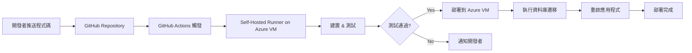

# CI/CD 實施計劃

為 BetterThanVieShow 電影院訂票系統建立完整的 CI/CD 流程，使用 Azure VM + GitHub Actions + Self-Hosted Runner。

## 用戶審核要項

> [!IMPORTANT]
> **Azure VM 資訊確認**
> 
> 請提供以下 Azure VM 相關資訊：
> 1. **VM 位址**：您是否已經有 Azure VM？如果有，請提供 IP 位址或主機名稱
> 2. **VM 作業系統**：Windows Server 或 Linux？版本為何？
> 3. **SSH/RDP 連線方式**：如何連接到 VM？
> 4. **資料庫配置**：資料庫是在 VM 上還是使用 Azure SQL Database？
> 5. **網頁伺服器**：計劃使用 IIS 還是 Kestrel（反向代理）？

> [!IMPORTANT]
> **GitHub Repository 資訊**
> 
> 1. Repository 是否已經設置？如果是，請提供 URL
> 2. 是否有特定的分支策略（如 main、develop、staging）？
> 3. 是否需要保護特定分支（需要 review 才能 merge）？

> [!WARNING]
> **環境變數與敏感資訊**
> 
> 以下敏感資訊需要設定為 GitHub Secrets：
> - 資料庫連線字串（Azure SQL 或 VM 上的 SQL Server）
> - JWT Secret Key
> - Azure VM 連線憑證（SSH Key 或密碼）
> - QR Code 加密金鑰

---

## 專案現狀分析

### 技術堆疊
- **框架**：ASP.NET Core 9.0
- **資料庫**：Azure SQL Database（需確認）或 SQL Server on VM
- **ORM**：Entity Framework Core 9.0
- **驗證**：JWT Bearer Authentication
- **套件管理**：NuGet

### 現有專案結構
```
betterthanvieshow/
├── betterthanvieshow/
│   ├── Controllers/          # API 控制器
│   ├── Services/             # 業務邏輯層
│   ├── Repositories/         # 資料存取層
│   ├── Models/               # 資料模型
│   ├── Data/                 # DbContext
│   ├── Migrations/           # EF Core 遷移
│   ├── Program.cs
│   └── betterthanvieshow.csproj
└── docs/                     # 文件
```

---

## 建議變更

### CI/CD 架構

#### 整體流程


---

### GitHub Actions 工作流程

#### [NEW] [ci-cd.yml](file:///C:/Users/VivoBook/Desktop/betterthanvieshow/.github/workflows/ci-cd.yml)

**CI/CD 工作流程**，在推送到 `main` 分支時觸發自動部署：

- 在 Self-Hosted Runner 上建置專案
- 執行程式碼分析與測試
- 自動部署到 Azure VM
- 執行資料庫遷移
- 健康檢查驗證

**主要步驟**：
1. 檢出程式碼
2. 設定 .NET 9.0 環境
3. 還原 NuGet 套件並建置
4. 執行測試
5. 發布專案
6. 停止 IIS 應用程式池
7. 備份現有版本
8. 部署新版本
9. 執行 EF Core 資料庫遷移
10. 啟動應用程式池
11. 健康檢查

---

### Azure VM 配置

#### VM 環境設置

**需要在 Azure VM 上安裝**：
1. **.NET 9.0 Hosting Bundle** - 用於執行 ASP.NET Core 應用程式
2. **GitHub Actions Runner** - Self-Hosted Runner 代理程式
3. **IIS** - 網頁伺服器

**服務設定**：
- 配置 IIS 應用程式池
- 設定防火牆規則開放 HTTP/HTTPS 埠
- 配置 Azure SQL Database 連線

---

### 配置檔案

#### [NEW] [appsettings.Production.json](file:///C:/Users/VivoBook/Desktop/betterthanvieshow/betterthanvieshow/appsettings.Production.json)

**生產環境配置檔**，包含：
- 生產資料庫連線字串（從環境變數讀取）
- JWT 設定（從環境變數讀取）
- Logging 等級調整
- CORS 政策

> [!CAUTION]
> 此檔案不應包含任何敏感資訊的實際值，僅包含從環境變數讀取的設定範本

---

### 部署腳本

#### [NEW] [deploy.ps1](file:///C:/Users/VivoBook/Desktop/betterthanvieshow/scripts/deploy.ps1)

**PowerShell 部署腳本**，用於：
- 停止 IIS 應用程式池
- 備份現有版本
- 複製新版本檔案
- 執行資料庫遷移
- 啟動應用程式服務
- 健康檢查

#### [NEW] [setup-iis.ps1](file:///C:/Users/VivoBook/Desktop/betterthanvieshow/scripts/setup-iis.ps1)

**IIS 初始化腳本**，用於：
- 安裝 IIS 功能
- 建立應用程式池
- 建立網站
- 配置權限
- 生成 web.config

---

### 數據庫遷移策略

**自動化 EF Core 遷移**：
- 在部署流程中自動執行 `dotnet ef database update`
- 使用 `--connection` 參數指定生產資料庫連線字串
- 設定遷移失敗時的回滾機制

---

## 驗證計劃

### 自動化測試

#### CI 流程驗證
```bash
# 本地測試 CI 流程
dotnet restore
dotnet build --configuration Release
dotnet test --no-build --verbosity normal
dotnet publish -c Release -o ./publish
```

#### CD 流程驗證
1. 推送測試變更到 repository
2. 監控 GitHub Actions 執行
3. 確認 Self-Hosted Runner 正常運作
4. 檢查部署後的應用程式狀態
5. 驗證資料庫遷移是否成功

### 手動驗證

#### Azure VM 連線測試
- 測試 RDP 連線到 VM
- 驗證 .NET SDK 版本
- 測試應用程式手動啟動

#### 應用程式健康檢查
- 驗證 API 端點回應正常
- 檢查資料庫連線
- 測試關鍵功能（註冊、登入、訂票等）

#### Self-Hosted Runner 測試
- 在 GitHub 上檢查 Runner 狀態
- 執行測試工作流程
- 查看 Runner 日誌

---

## 實施順序

1. **Azure VM 準備**
   - 安裝必要軟體
   - 配置網路與防火牆

2. **Self-Hosted Runner 設置**
   - 在 VM 上安裝並註冊 Runner
   - 測試連線

3. **建立 GitHub Actions 工作流程**
   - 建立 CI/CD 工作流程
   - 測試通過後啟用自動部署

4. **配置 Secrets**
   - 在 GitHub Repository 設定所有敏感資訊

5. **建立部署腳本**
   - 配置 IIS
   - 測試部署流程

6. **端到端測試**
   - 完整測試 CI/CD 流程

7. **文件撰寫**
   - 撰寫操作手冊與維護指南

---

## 後續考量

### 監控與日誌
- 考慮整合 Azure Application Insights
- 設定日誌聚合與告警

### 安全性
- 定期更新 VM 與依賴套件
- 實施資料庫備份策略
- 設定 HTTPS 憑證（Let's Encrypt）

### 效能優化
- 考慮使用 Azure CDN
- 實施快取策略
- 資料庫效能調校
