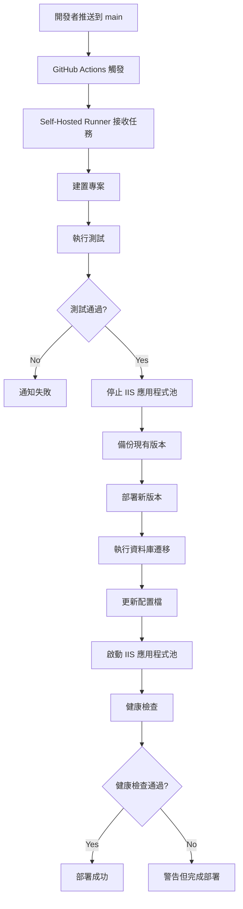

# CI/CD 實施完成報告

本文件總結了為 BetterThanVieShow 電影院訂票系統實施的 CI/CD 流程。

---

## ✅ 已完成的工作

### 1. GitHub Actions 工作流程配置

#### [.github/workflows/ci-cd.yml](file:///C:/Users/VivoBook/Desktop/betterthanvieshow/.github/workflows/ci-cd.yml)

建立了完整的 CI/CD 自動化流程，包含：

**觸發條件**：
- 當程式碼推送到 `main` 分支時自動部署
- Pull Request 到 `main` 分支時執行建置和測試

**主要步驟**：
1. 檢出程式碼
2. 設定 .NET 9.0 環境
3. 還原 NuGet 套件並建置
4. 執行測試
5. 發布專案
6. 停止 IIS 應用程式池
7. 備份現有版本
8. 部署新版本到 IIS
9. 執行 EF Core 資料庫遷移
10. 更新生產環境配置
11. 啟動 IIS 應用程式池
12. 健康檢查驗證
13. 部署結果通知

---

### 2. 部署腳本

#### [scripts/deploy.ps1](file:///C:/Users/VivoBook/Desktop/betterthanvieshow/scripts/deploy.ps1)

手動部署腳本，支援：
- 自動建置專案
- IIS 應用程式池管理
- 版本備份機制
- 資料庫遷移
- 部署驗證

**使用方式**：
```powershell
.\scripts\deploy.ps1 -ConnectionString "YOUR_CONNECTION_STRING"
```

#### [scripts/setup-iis.ps1](file:///C:/Users/VivoBook/Desktop/betterthanvieshow/scripts/setup-iis.ps1)

IIS 初始化配置腳本，包含：
- IIS 功能安裝檢查
- 應用程式池建立與配置
- 網站目錄建立與權限設定
- IIS 網站建立
- web.config 生成

---

### 3. 生產環境配置

#### [betterthanvieshow/appsettings.Production.json](file:///C:/Users/VivoBook/Desktop/betterthanvieshow/betterthanvieshow/appsettings.Production.json)

生產環境專用配置檔，包含：
- 資料庫連線字串佔位符
- JWT 設定
- 日誌等級配置
- CORS 政策

> [!IMPORTANT]
> 此檔案使用佔位符（`#{...}#`），實際值將在部署時由 GitHub Actions 從 Secrets 注入。

---

### 4. 應用程式改進

#### [betterthanvieshow/Program.cs](file:///C:/Users/VivoBook/Desktop/betterthanvieshow/betterthanvieshow/Program.cs)

新增健康檢查功能：
- 端點：`/health`
- 檢查項目：資料庫連線狀態
- 用途：CI/CD 部署後驗證

**測試**：
```bash
curl http://your-server/health
# 回應: Healthy
```

---

## 📋 建立的檔案清單

```
betterthanvieshow/
├── .github/
│   └── workflows/
│       └── ci-cd.yml                          # GitHub Actions 工作流程
├── scripts/
│   ├── deploy.ps1                             # 手動部署腳本
│   └── setup-iis.ps1                          # IIS 初始化腳本
└── betterthanvieshow/
    ├── appsettings.Production.json            # 生產環境配置
    └── Program.cs                             # 已新增健康檢查端點
```

---

## 🎯 下一步操作

### 在 Azure VM 上執行設置

1. **連接到 Azure VM**
   - 使用 RDP 連接到您的 Azure VM

2. **安裝 .NET 9.0 Hosting Bundle**
   - 從 https://dotnet.microsoft.com/download/dotnet/9.0 下載
   - 安裝後重啟伺服器

3. **執行 IIS 設置腳本**
   ```powershell
   # 將 setup-iis.ps1 複製到 VM
   Set-ExecutionPolicy -ExecutionPolicy RemoteSigned -Scope Process
   .\setup-iis.ps1
   ```

4. **安裝 GitHub Actions Runner**
   - 前往: https://github.com/YOUR_USERNAME/betterthanvieshow/settings/actions/runners/new
   - 按照指示下載並配置 Runner
   - 安裝為 Windows 服務

5. **配置 GitHub Secrets**
   
   前往 Repository Settings > Secrets and variables > Actions，添加：
   
   | Secret 名稱 | 說明 |
   |------------|------|
   | `AZURE_SQL_CONNECTION_STRING` | Azure SQL 連線字串 |
   | `JWT_SECRET_KEY` | JWT 密鑰（32+ 字元）|
   | `IIS_SITE_PATH` | `C:\inetpub\wwwroot\betterthanvieshow` |
   | `IIS_APP_POOL_NAME` | `BetterThanVieShowAppPool` |
   | `SITE_URL` | 您的網站 URL |

6. **推送到 GitHub 觸發首次部署**
   ```bash
   git add .
   git commit -m "feat: add CI/CD pipeline"
   git push origin main
   ```

---

## ⚠️ 重要注意事項

> [!WARNING]
> **敏感資訊保護**
> 
> - 絕不要將連線字串或密鑰直接寫在程式碼中
> - 所有敏感資訊都應設定為 GitHub Secrets
> - `appsettings.Production.json` 使用佔位符，部署時自動替換

> [!IMPORTANT]
> **Runner 必須正常運行**
> 
> - GitHub Actions 使用 Self-Hosted Runner 執行
> - Runner 必須在 VM 上持續運行
> - 建議安裝為 Windows 服務以確保自動啟動

> [!NOTE]
> **資料庫遷移**
> 
> - 每次部署會自動執行 `dotnet ef database update`
> - 確保連線字串正確設定
> - 如遷移失敗，可手動執行

---

## 🔍 驗證檢查清單

在完成設置後，請驗證：

- [ ] .NET 9.0 SDK 已安裝在 VM 上
- [ ] IIS 網站已建立（BetterThanVieShow）
- [ ] IIS 應用程式池已建立（BetterThanVieShowAppPool）
- [ ] GitHub Actions Runner 顯示 "Idle" 狀態
- [ ] 所有 GitHub Secrets 已設定
- [ ] 推送程式碼後 Actions 成功執行
- [ ] `/health` 端點可訪問
- [ ] API 端點正常運作
- [ ] 資料庫連線正常

---

## 📊 CI/CD 流程圖



---

## 🎉 總結

CI/CD 流程已完整配置！所有必要的檔案和腳本都已建立並可供使用。

**主要優勢**：
- ✅ 自動化部署：推送到 main 即自動部署
- ✅ 安全性：敏感資訊透過 GitHub Secrets 管理
- ✅ 可靠性：包含備份、遷移和健康檢查
- ✅ 可維護性：完整的文件和腳本

**下一步**：
1. 在 Azure VM 上完成設置
2. 設定 GitHub Secrets
3. 推送程式碼觸發首次部署
4. 驗證部署結果
