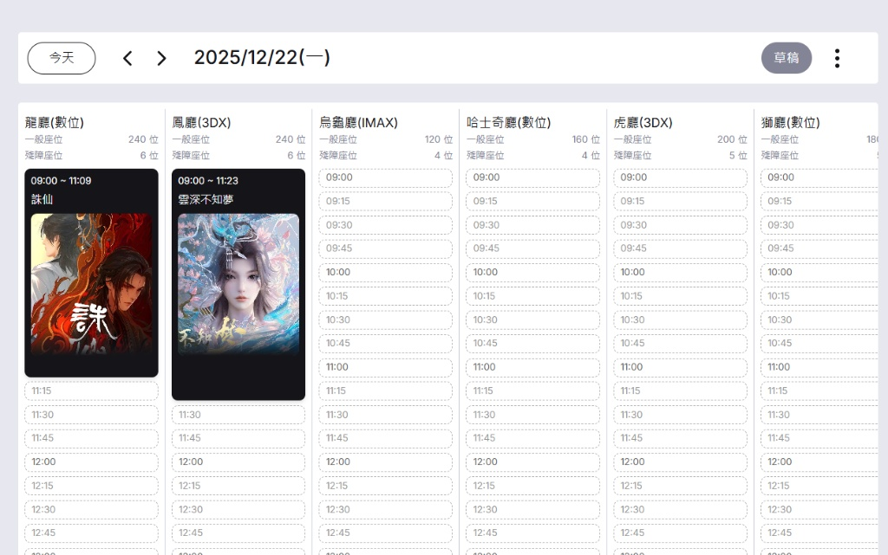
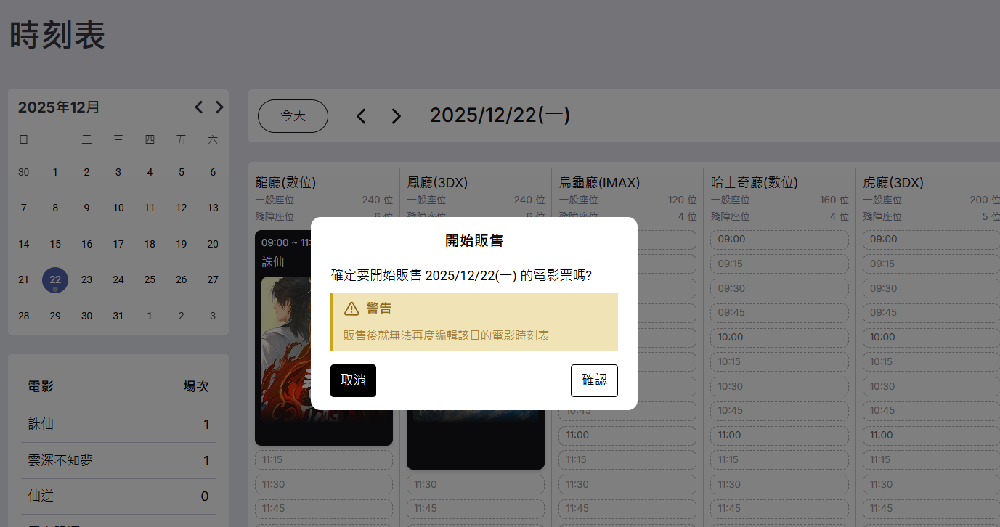

# 電影時刻表場次管理規格 - 2025/12/22

## 原始需求描述

這份規格文件用來描述新功能的設計，包括
我的API功能表，需求是這樣的，你可以新增一個場次，這個場次如圖，會有日期，每個時間放映什麼電影，在哪一個廳室，這時是草稿狀態，然後編輯完成之後會問你是否販售，範售之後就無法編輯

### UI 參考圖

 


---

## 規格分析結果

### 1. 資料模型 (Data Model)

新增實體：**DailySchedule（每日時刻表）**

| 屬性 | 類型 | 說明 |
|------|------|------|
| id | int | 每日時刻表 ID |
| schedule_date | string | 日期，格式 YYYY-MM-DD，必須唯一 |
| status | string | 狀態：Draft（草稿）、OnSale（販售中） |
| created_at | string | 建立時間 |
| updated_at | string | 最後更新時間 |

**狀態流程：**
```
Draft (草稿) → OnSale (販售中)
```
- 新建時刻表預設為 Draft 狀態
- 確認販售後轉為 OnSale
- OnSale 狀態不可逆轉

**關聯：**
- DailySchedule 1:N MovieShowTime（通過 schedule_date = show_date 隱式關聯）

### 2. 功能模型 (Functional Model)

#### 新增/更新的 Feature 檔案：

1. **開始販售時刻表.feature** (新增)
   - 草稿狀態可開始販售
   - 販售確認需要二次確認
   - 販售後該日期的場次無法編輯
   - 販售狀態不可逆轉

2. **設定場次.feature** (更新)
   - 新增規則：只有草稿狀態的日期可以設定場次
   - 新增規則：新增場次時自動建立或關聯每日時刻表

3. **編輯場次.feature** (新增)
   - 草稿狀態的場次可以編輯
   - 販售中狀態的場次無法編輯
   - 編輯場次時需檢查時間衝突

4. **刪除場次.feature** (更新)
   - 草稿狀態的場次可以刪除
   - 販售中狀態的場次無法刪除

### 3. 業務規則摘要

| 操作 | Draft (草稿) | OnSale (販售中) |
|------|:------------:|:---------------:|
| 新增場次 | ✅ 允許 | ❌ 禁止 |
| 編輯場次 | ✅ 允許 | ❌ 禁止 |
| 刪除場次 | ✅ 允許 | ❌ 禁止 |
| 開始販售 | ✅ 允許 | - (已販售) |

---

## 產出檔案

- `spec/erm.dbml` - 更新資料模型，新增 DailySchedule 實體
- `spec/features/開始販售時刻表.feature` - 新增
- `spec/features/編輯場次.feature` - 新增
- `spec/features/設定場次.feature` - 更新
- `spec/features/刪除場次.feature` - 更新